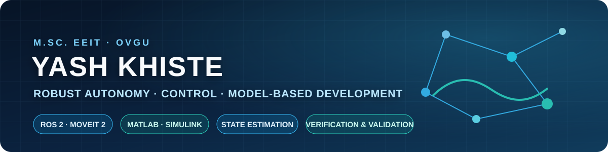

  

  
  

## Engineering Profile

M.Sc. Electrical Engineering & Information Technology student at **Otto von Guericke University Magdeburg**, building control and autonomous systems through reproducible models, C++ robotics software and verification-first testing.

| Engineering evidence | Verified result |
|---|---|
| **ROS 2 manipulation** | 6 C++17 executables integrating state monitoring, joint/Cartesian planning, obstacle avoidance, mission sequencing and controlled pose-fault injection |
| **Electric-drive V&V** | Nominal, payload, external-load and viscous-resistance checks passed analytical cross-validation with zero error at reported precision |
| **Model-based control** | P, PI, filtered PID and LQR compared with actuator constraints and MATLAB↔Simulink validation |
| **Industrial problem solving** | Brake-joint poka-yoke reduced offline RPT from 15 vehicles to 1–3; PLC logic supported 6+ AGV stations |

## Selected work

| ROS 2 Resilient Manipulation | Electric Drive Control & V&V |
|:---:|:---:|
|  |  |
| **ROS 2 · MoveIt 2 · C++17** Collision-aware Panda mission with stale-pose fault detection and reproducible launch workflows. | **MATLAB · Simulink · Verification** Parameterized AGV plant with automated scenario testing, plots, datasets and verification reports. |

### [Automotive Cruise Control — Model-Based Control](https://github.com/yashrk7174/Automotive-Cruise-Control-Model-Based-Control)

**P → PI → Filtered PID → LQR** development with sensitivity analysis, actuator-limit verification and numerical MATLAB/Simulink agreement. The final constrained LQR test passes stability, tracking and actuator-output checks.

<strong>More engineering projects</strong>

 

- [RoboTwin-Sync](https://github.com/yashrk7174/RoboTwin-Sync-Bidirectional-Digital-Twin-for-Mobile-Manipulator-Robotics) — bidirectional digital-twin framework for mobile-manipulator systems.
- [Digital Signal Processing](https://github.com/yashrk7174/Digital-Signal-Processing-Sampling-Audio-ECG-Analysis) — sampling, reconstruction, spectral analysis, audio, Doppler and ECG processing.
- [Industrial AGV Navigation and Drive Control](https://github.com/yashrk7174/Industrial-AGV-Navigation-and-Drive-Control) — magnetic navigation, deviation monitoring and BLDC drive integration.
- [Brake-Joint Online Pre-Leak Poka-Yoke](https://github.com/yashrk7174/Brake-Joint-Online-Pre-Leak-Testing-Poka-Yoke) — production interlock and online verification preventing no-brake vehicle rollout.

## Technical stack

  
  
  
  
  
  
  
  

<strong>Verification-first workflow</strong>

 

1. Define the operating assumptions and acceptance criteria.
2. Derive reference behaviour from physics or system requirements.
3. Implement the model, controller or planner reproducibly.
4. Exercise nominal, disturbed and failure scenarios.
5. Compare observed behaviour with defined references.
6. Publish traceable code, plots, datasets and verification evidence.

<strong>Current development roadmap</strong>

 

- Bounded recovery under perception and execution faults.
- EKF/UKF-based pose estimation and uncertainty monitoring.
- Closed-loop AGV velocity control followed by PMSM FOC and power-electronics modelling.
- MIL/SIL regression workflows for repeatable virtual verification.

## Engineering principle

> A system is not complete when it runs once—it is complete when its assumptions, failure cases and results can be reproduced and defended.

  <a href="https://www.linkedin.com/in/yash-khiste-95b8371a9">LinkedIn</a> ·
  <a href="https://github.com/yashrk7174?tab=repositories">Repositories</a>

