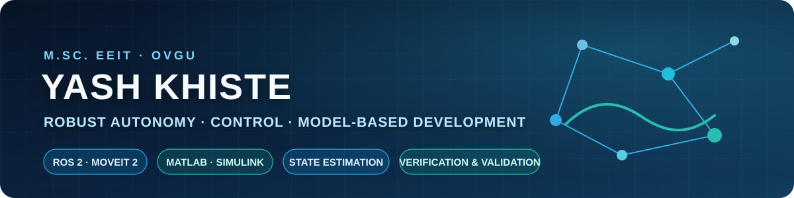

  

  
  

## Engineering Profile

M.Sc. Electrical Engineering & Information Technology student at **Otto von Guericke University Magdeburg**, building control and autonomous systems through physics-based modelling, C++ robotics software and verification-first engineering.

| Engineering evidence | Verified result |
|---|---|
| **ROS 2 manipulation** | C++17 executables integrating state monitoring, joint/Cartesian planning, obstacle avoidance, mission sequencing and controlled pose-fault injection |
| **Electric-drive control & V&V** | PMSM–AGV integration, dq current control and cascaded motor-speed/current control verified through automated analytical cross-validation |
| **Control-system design** | Current-loop and outer speed-loop PI controllers designed from explicit bandwidth, tracking and settling requirements |
| **Industrial problem solving** | Brake-joint poka-yoke reduced offline RPT from 15 vehicles to 1–3; PLC logic supported 6+ AGV stations |

## Selected work

| ROS 2 Resilient Manipulation | Electric Drive Control & V&V |
|:---:|:---:|
|  |  |
| **ROS 2 · MoveIt 2 · C++17** Collision-aware Panda mission with stale-pose fault detection and reproducible launch workflows. | **MATLAB · Simulink · Simscape · Control · V&V** PMSM–AGV electric drive with verified dq current regulation and cascaded motor-speed control. |

### [Automotive Cruise Control — Model-Based Control](https://github.com/yashrk7174/Automotive-Cruise-Control-Model-Based-Control)

**P → PI → Filtered PID → LQR** development with sensitivity analysis, actuator-limit verification and numerical MATLAB/Simulink agreement. The final constrained LQR test passes stability, tracking and actuator-output checks.

<strong>More engineering projects</strong>

 

- [RoboTwin-Sync](https://github.com/yashrk7174/RoboTwin-Sync-Bidirectional-Digital-Twin-for-Mobile-Manipulator-Robotics) — bidirectional digital-twin framework for mobile-manipulator systems.
- [Digital Signal Processing](https://github.com/yashrk7174/Digital-Signal-Processing-Sampling-Audio-ECG-Analysis) — sampling, reconstruction, spectral analysis, audio, Doppler and ECG processing.
- [Industrial AGV Navigation and Drive Control](https://github.com/yashrk7174/Industrial-AGV-Navigation-and-Drive-Control) — magnetic navigation, deviation monitoring and BLDC drive integration.
- [Brake-Joint Online Pre-Leak Poka-Yoke](https://github.com/yashrk7174/Brake-Joint-Online-Pre-Leak-Testing-Poka-Yoke) — production interlock and online verification preventing no-brake vehicle rollout.

## Technical stack

  
  
  
  
  
  
  
  
  

<strong>Verification-first workflow</strong>

 

1. Define operating assumptions, interfaces and acceptance criteria.
2. Derive independent reference behaviour from physics or system requirements.
3. Implement the model, controller or planner reproducibly.
4. Exercise nominal, disturbed and failure scenarios.
5. Quantitatively compare observed behaviour against defined references.
6. Record PASS/FAIL results and publish traceable engineering evidence.

<strong>Current development roadmap</strong>

 

**Robust Autonomy**
- Bounded recovery under perception and execution faults.
- EKF/UKF-based pose estimation and uncertainty monitoring.

**Electric Drive**
- Full Clarke/Park and inverse transformation chain.
- PMSM field-oriented control architecture.
- Inverter and PWM/SVPWM modelling.
- Sensor nonidealities and signal-processing effects.
- C/C++ controller implementation.
- MIL/SIL regression and automated virtual verification.

## Engineering principle

> A system is not complete when it runs once—it is complete when its assumptions, failure cases and results can be reproduced and defended.

  <a href="https://www.linkedin.com/in/yash-khiste-95b8371a9">LinkedIn</a> ·
  <a href="https://github.com/yashrk7174?tab=repositories">Repositories</a>

